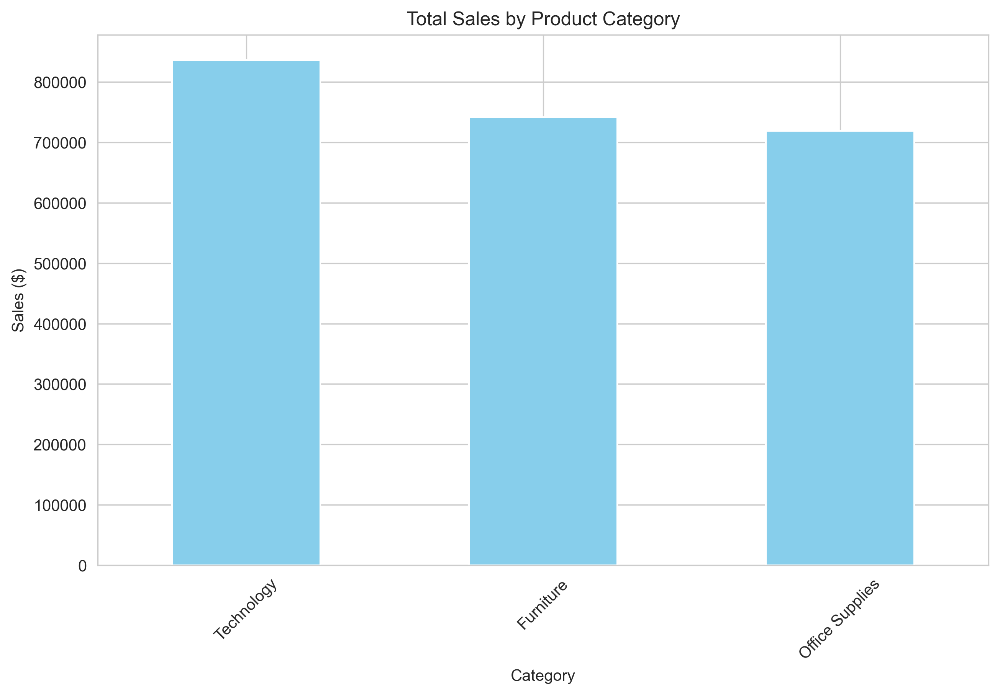
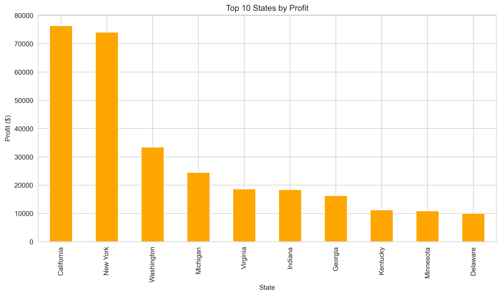
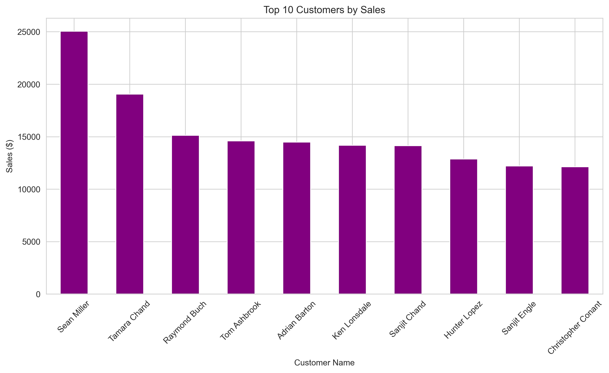
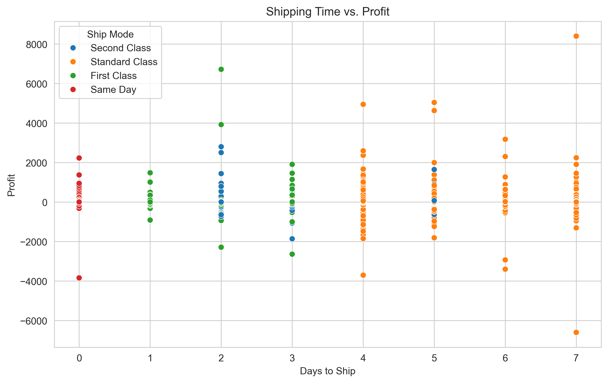
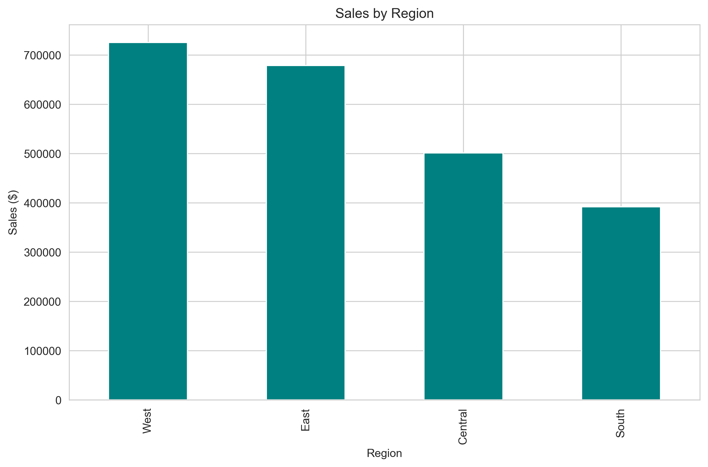

# Superstore Data Analysis Project

A comprehensive data analysis project exploring sales, profitability, and customer behavior patterns in a retail superstore dataset.

## 📌 Project Overview

This project analyzes a Superstore dataset containing:
- 9,994 transactions
- 21 variables including sales, profit, product categories, and customer segments
- Data spanning 2014-2017

Key analysis areas:
### Sales Analysis by Product Category
  
## 1. Overall Sales Distribution
- **Technology Dominates**: Leads all categories with **$836,154.03** in total sales
- **Close Competition**: 
  - Furniture follows closely with **$741,999.80**
  - Office Supplies trails slightly at **$719,047.03**

## 2. Key Observations
- **$117K Gap** between Technology (highest) and Office Supplies (lowest)
- **Technology accounts for 36%** of combined category sales ($2.3M total)
- Furniture and Office Supplies each represent ~31-32% of total sales

## 3. Strategic Implications
1. **Growth Opportunities**:
   - Technology's lead suggests strong market demand - consider expanding product lines
   - Office Supplies (while lowest) shows potential to close gap with targeted promotions

2. **Inventory Planning**:
   - Allocate more shelf space/displays to Technology products
   - Maintain balanced inventory for Furniture given its near-parity performance

3. **Marketing Focus**:
   - Highlight Technology products in advertising to reinforce category leadership
   - Bundle Office Supplies with Technology items to boost cross-category sales

4. **Profitability Cross-Check**:
   - *Note*: While Technology leads in sales, further analysis needed to confirm:
     - Profit margins per category
     - Return rates/warranty costs
     - Customer acquisition costs by category
- ### Customer segmentation (RFM analysis)
  This visualization shows our customer segmentation based on:
  Recency (how recently they purchased)
  Frequency (how often they purchase)
  Monetary value (how much they spend)
  
- ### Profitability by category and region
  
- ### Top 10 States by Profit
  
-  ### Top Customers by Sales
  

- ### Shipping and operational efficiency
 
  
  
## 🛠️ Technologies Used
- **Python 3.8+**
- **Pandas** - Data manipulation and analysis
- **NumPy** - Numerical operations
- **Matplotlib/Seaborn** - Data visualization
- **Jupyter Notebook** - Interactive analysis environment

